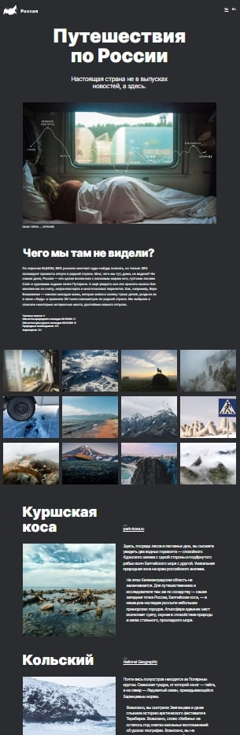

# Проект: Путешествие по России



## Проектная работа Яндекс Практикум - Адаптивная верстка

[Ссылка на GitHub pages](https://sergeyromadin.github.io/)

```
В этом проекте использованы основные технологии применяющиеся в верстке:
* HTML
* CSS
* БЭМ

```

### Глазков Сергей Сергеевич
